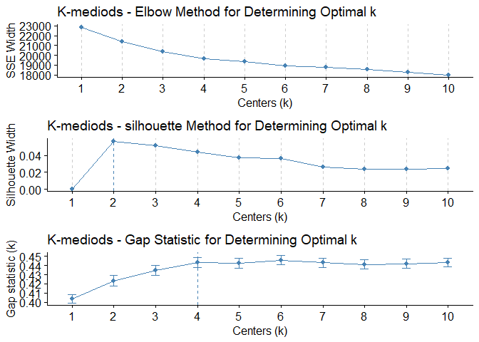
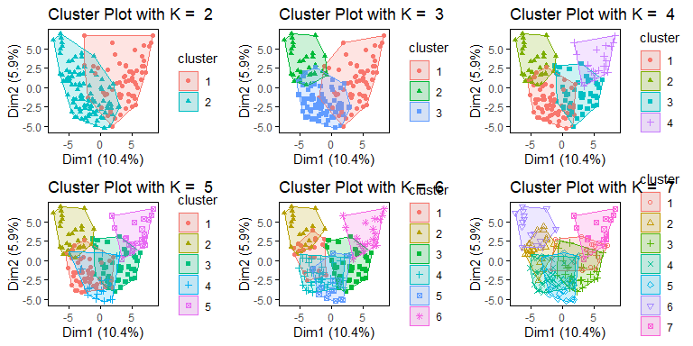
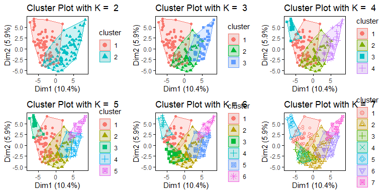

Cluster Analysis With R
================
Author - Joshua Registe

## Outline

[RMarkdown Source Code](https://github.com/joshuargst/Machine-Learning-with-R-and-Python/blob/main/Clustering/Clustering.Rmd)

-   [Clustering Intro](#Clustering)  
-   [Data Exploration](#Data-Exploration)  
-   [Data Prep](#Data-preparation)  
-   [Implementing K-means](#K-means)
-   [Implementing K-mediods](#K-mediods)
-   [Implementing Hierarchical Clustering](#Hierarchical-Clustering)
-   [References](#References)

## Clustering

-   [Return to Outline](#Outline)

Unsupervised learning is a method of machine learning that refers to
predict information based on unlabeled data. It looks at unlabeled data
and recognizes patterns from this data to make certain outcome
predictions. A business case for unsupervised learning could be for
customer segmentation, where customers are placed in certain groups and
that is used for advertisements and marketing. Genetics is another
example of clustering where DNA patterns could be used to understand
biology in many aspects, Anomaly detection could be used where a certain
observation could be identified to be far outside the boundaries of
other observations, and also recommender systems where similarity
matrices between groups can define which individuals may enjoy the same
movies, music, shows, etc.

The dimensionality reduction techniques presented in this document will
showcase the implementation of:

**1. K-means clustering** - K-means works by creating unamed/new
observations that serve as “centroids” which are used to compute the
euclidean distance between the centroid and the surrounding
observations, which then assigns them into categories. It takes the
average (hence k-means) of the points in each category and recomputes
these centroids. Centroids are re-computed until there is no change in
centroid position. “k” must be defined and represents the number of
clusters to be computed. This can be optimized via several methods that
are discussed in this document.

**2. K-medoids** - K-mediod is similar to k-means however, the
convergence of the cluster’s is based on median values rather than
means. K-medians can be used with any similarity measure while k-means
is typically based on euclidian distances. As one might expect,
K-mediods also more robust to outliers as it wont suffer from severe
skews that may occur in different distributions. K-mediods is typically
more computationally expensive and takes longer to run than k-means.

**3. Hierarchical Clustering** - Hierarchical clustering works a
different from K-means where the data all start out in their individual
clusters and then are grouped together hierarchically based on the
distance between points. Unlike k-means, this method does not need
advance knowledge of number of clusters. Hierarchical can stop at any
number of clusters depending on their interpretation of the dendrogram
formed by the method. This method is not computationally efficient for
large datasets and can be expansive and slow.

## Data Exploration

-   [Return to Outline](#Outline)

The Data set being explored in this document a survey used to assess
Attention deficit hyper activity disorder (ADHD). The dataset consist of
information about patients as well as survey questions that attempt to
segment users into those that are likely or not-likely to have ADHD. The
data dictionary is presented below.

C: Sex: Male-1, Female-2  
D: Race: White-1, African American-2, Hispanic-3, Asian-4, Native
American-5, Other or missing data -6  
E - W ADHD self-report scale: Never-0, rarely-1, sometimes-2, often-3,
very often-4  
X – AM Mood disorder questions: No-0, yes-1; question 3: no problem-0,
minor-1, moderate-2, serious-3  
AN – AS Individual substances misuse: no use-0, use-1, abuse-2,
dependence-3  
AT Court Order: No-0, Yes-1  
AU Education: 1-12 grade, 13+ college  
AV History of Violence: No-0, Yes-1  
AW Disorderly Conduct: No-0, Yes-1  
AX Suicide attempt: No-0, Yes-1  
AY Abuse Hx: No-0, Physical (P)-1, Sexual (S)-2, Emotional (E)-3, P&S-4,
P&E-5, S&E-6, P&S&E-7  
AZ Non-substance-related Dx: 0 – none; 1 – one; 2 – More than one  
BA Substance-related Dx: 0 – none; 1 – one Substance-related; 2 – two; 3
– three or more  
BB Psychiatric Meds: 0 – none; 1 – one psychotropic med; 2 – more than
one psychotropic med

This dataset is a mental health dataset from a real-life research
project. All identifying information of the dataset is removed. The data
contains 54 variables with 175 observations per variable. Every variable
in the dataset is imported in as numeric features with the exception of
`Initial` which will not be used as part of any exploration or analysis.
Below

``` r
ADHD_data<-read_csv("ADHD_data.csv")
names(ADHD_data)<-str_replace_all(names(ADHD_data)," +","_")
names(ADHD_data)<-str_replace_all(names(ADHD_data),"-","_")
skimr::skim(ADHD_data)
```

|                                                  |            |
|:-------------------------------------------------|:-----------|
| Name                                             | ADHD\_data |
| Number of rows                                   | 175        |
| Number of columns                                | 54         |
| \_\_\_\_\_\_\_\_\_\_\_\_\_\_\_\_\_\_\_\_\_\_\_   |            |
| Column type frequency:                           |            |
| character                                        | 1          |
| numeric                                          | 53         |
| \_\_\_\_\_\_\_\_\_\_\_\_\_\_\_\_\_\_\_\_\_\_\_\_ |            |
| Group variables                                  | None       |

Data summary

**Variable type: character**

| skim\_variable | n\_missing | complete\_rate | min | max | empty | n\_unique | whitespace |
|:---------------|-----------:|---------------:|----:|----:|------:|----------:|-----------:|
| Initial        |          0 |              1 |   2 |   3 |     0 |       108 |          0 |

**Variable type: numeric**

| skim\_variable      | n\_missing | complete\_rate |  mean |    sd |  p0 |  p25 | p50 |  p75 | p100 | hist  |
|:--------------------|-----------:|---------------:|------:|------:|----:|-----:|----:|-----:|-----:|:------|
| Age                 |          0 |           1.00 | 39.47 | 11.17 |  18 | 29.5 |  42 | 48.0 |   69 | ▆▅▇▅▁ |
| Sex                 |          0 |           1.00 |  1.43 |  0.50 |   1 |  1.0 |   1 |  2.0 |    2 | ▇▁▁▁▆ |
| Race                |          0 |           1.00 |  1.64 |  0.69 |   1 |  1.0 |   2 |  2.0 |    6 | ▇▁▁▁▁ |
| ADHD\_Q1            |          0 |           1.00 |  1.70 |  1.29 |   0 |  1.0 |   2 |  3.0 |    4 | ▇▇▇▆▃ |
| ADHD\_Q2            |          0 |           1.00 |  1.91 |  1.25 |   0 |  1.0 |   2 |  3.0 |    4 | ▅▇▇▆▅ |
| ADHD\_Q3            |          0 |           1.00 |  1.91 |  1.27 |   0 |  1.0 |   2 |  3.0 |    4 | ▅▇▇▆▅ |
| ADHD\_Q4            |          0 |           1.00 |  2.10 |  1.34 |   0 |  1.0 |   2 |  3.0 |    4 | ▅▅▇▅▆ |
| ADHD\_Q5            |          0 |           1.00 |  2.26 |  1.44 |   0 |  1.0 |   3 |  3.0 |    5 | ▇▅▇▆▁ |
| ADHD\_Q6            |          0 |           1.00 |  1.91 |  1.31 |   0 |  1.0 |   2 |  3.0 |    4 | ▆▅▇▇▃ |
| ADHD\_Q7            |          0 |           1.00 |  1.83 |  1.19 |   0 |  1.0 |   2 |  3.0 |    4 | ▃▇▇▃▃ |
| ADHD\_Q8            |          0 |           1.00 |  2.14 |  1.29 |   0 |  1.0 |   2 |  3.0 |    4 | ▃▇▇▇▆ |
| ADHD\_Q9            |          0 |           1.00 |  1.91 |  1.32 |   0 |  1.0 |   2 |  3.0 |    4 | ▆▇▇▇▅ |
| ADHD\_Q10           |          0 |           1.00 |  2.12 |  1.23 |   0 |  1.0 |   2 |  3.0 |    4 | ▂▇▇▆▅ |
| ADHD\_Q11           |          0 |           1.00 |  2.27 |  1.24 |   0 |  1.0 |   2 |  3.0 |    4 | ▂▆▇▇▆ |
| ADHD\_Q12           |          0 |           1.00 |  1.29 |  1.21 |   0 |  0.0 |   1 |  2.0 |    4 | ▇▇▆▂▂ |
| ADHD\_Q13           |          0 |           1.00 |  2.37 |  1.23 |   0 |  1.5 |   2 |  3.0 |    4 | ▂▅▇▇▆ |
| ADHD\_Q14           |          0 |           1.00 |  2.25 |  1.35 |   0 |  1.0 |   2 |  3.0 |    4 | ▅▅▇▇▆ |
| ADHD\_Q15           |          0 |           1.00 |  1.63 |  1.39 |   0 |  0.0 |   1 |  3.0 |    4 | ▇▆▆▅▃ |
| ADHD\_Q16           |          0 |           1.00 |  1.70 |  1.38 |   0 |  1.0 |   1 |  3.0 |    4 | ▆▇▆▃▅ |
| ADHD\_Q17           |          0 |           1.00 |  1.53 |  1.29 |   0 |  0.0 |   1 |  2.0 |    4 | ▇▇▇▃▃ |
| ADHD\_Q18           |          0 |           1.00 |  1.47 |  1.30 |   0 |  0.0 |   1 |  2.0 |    4 | ▇▇▆▃▃ |
| ADHD\_Total         |          0 |           1.00 | 34.32 | 16.70 |   0 | 21.0 |  33 | 47.5 |   72 | ▃▆▇▆▂ |
| MD\_Q1a             |          0 |           1.00 |  0.55 |  0.50 |   0 |  0.0 |   1 |  1.0 |    1 | ▆▁▁▁▇ |
| MD\_Q1b             |          0 |           1.00 |  0.57 |  0.50 |   0 |  0.0 |   1 |  1.0 |    1 | ▆▁▁▁▇ |
| MD\_Q1c             |          0 |           1.00 |  0.54 |  0.50 |   0 |  0.0 |   1 |  1.0 |    1 | ▇▁▁▁▇ |
| MD\_Q1d             |          0 |           1.00 |  0.58 |  0.49 |   0 |  0.0 |   1 |  1.0 |    1 | ▆▁▁▁▇ |
| MD\_Q1e             |          0 |           1.00 |  0.55 |  0.50 |   0 |  0.0 |   1 |  1.0 |    1 | ▆▁▁▁▇ |
| MD\_Q1f             |          0 |           1.00 |  0.70 |  0.46 |   0 |  0.0 |   1 |  1.0 |    1 | ▃▁▁▁▇ |
| MD\_Q1g             |          0 |           1.00 |  0.72 |  0.45 |   0 |  0.0 |   1 |  1.0 |    1 | ▃▁▁▁▇ |
| MD\_Q1h             |          0 |           1.00 |  0.56 |  0.50 |   0 |  0.0 |   1 |  1.0 |    1 | ▆▁▁▁▇ |
| MD\_Q1i             |          0 |           1.00 |  0.59 |  0.49 |   0 |  0.0 |   1 |  1.0 |    1 | ▆▁▁▁▇ |
| MD\_Q1j             |          0 |           1.00 |  0.39 |  0.49 |   0 |  0.0 |   0 |  1.0 |    1 | ▇▁▁▁▅ |
| MD\_Q1k             |          0 |           1.00 |  0.49 |  0.50 |   0 |  0.0 |   0 |  1.0 |    1 | ▇▁▁▁▇ |
| MD\_Q1L             |          0 |           1.00 |  0.58 |  0.49 |   0 |  0.0 |   1 |  1.0 |    1 | ▆▁▁▁▇ |
| MD\_Q1m             |          0 |           1.00 |  0.49 |  0.50 |   0 |  0.0 |   0 |  1.0 |    1 | ▇▁▁▁▇ |
| MD\_Q2              |          0 |           1.00 |  0.72 |  0.45 |   0 |  0.0 |   1 |  1.0 |    1 | ▃▁▁▁▇ |
| MD\_Q3              |          0 |           1.00 |  2.01 |  1.07 |   0 |  1.0 |   2 |  3.0 |    3 | ▂▂▁▅▇ |
| MD\_TOTAL           |          0 |           1.00 | 10.02 |  4.81 |   0 |  6.5 |  11 | 14.0 |   17 | ▃▃▆▇▇ |
| Alcohol             |          4 |           0.98 |  1.35 |  1.39 |   0 |  0.0 |   1 |  3.0 |    3 | ▇▂▁▁▆ |
| THC                 |          4 |           0.98 |  0.81 |  1.27 |   0 |  0.0 |   0 |  1.5 |    3 | ▇▁▁▁▃ |
| Cocaine             |          4 |           0.98 |  1.09 |  1.39 |   0 |  0.0 |   0 |  3.0 |    3 | ▇▁▁▁▅ |
| Stimulants          |          4 |           0.98 |  0.12 |  0.53 |   0 |  0.0 |   0 |  0.0 |    3 | ▇▁▁▁▁ |
| Sedative\_hypnotics |          4 |           0.98 |  0.12 |  0.54 |   0 |  0.0 |   0 |  0.0 |    3 | ▇▁▁▁▁ |
| Opioids             |          4 |           0.98 |  0.39 |  0.99 |   0 |  0.0 |   0 |  0.0 |    3 | ▇▁▁▁▁ |
| Court\_order        |          5 |           0.97 |  0.09 |  0.28 |   0 |  0.0 |   0 |  0.0 |    1 | ▇▁▁▁▁ |
| Education           |          9 |           0.95 | 11.90 |  2.17 |   6 | 11.0 |  12 | 13.0 |   19 | ▁▅▇▂▁ |
| Hx\_of\_Violence    |         11 |           0.94 |  0.24 |  0.43 |   0 |  0.0 |   0 |  0.0 |    1 | ▇▁▁▁▂ |
| Disorderly\_Conduct |         11 |           0.94 |  0.73 |  0.45 |   0 |  0.0 |   1 |  1.0 |    1 | ▃▁▁▁▇ |
| Suicide             |         13 |           0.93 |  0.30 |  0.46 |   0 |  0.0 |   0 |  1.0 |    1 | ▇▁▁▁▃ |
| Abuse               |         14 |           0.92 |  1.33 |  2.12 |   0 |  0.0 |   0 |  2.0 |    7 | ▇▂▁▁▁ |
| Non\_subst\_Dx      |         22 |           0.87 |  0.44 |  0.68 |   0 |  0.0 |   0 |  1.0 |    2 | ▇▁▃▁▁ |
| Subst\_Dx           |         23 |           0.87 |  1.14 |  0.93 |   0 |  0.0 |   1 |  2.0 |    3 | ▆▇▁▅▂ |
| Psych\_meds.        |        118 |           0.33 |  0.96 |  0.80 |   0 |  0.0 |   1 |  2.0 |    2 | ▇▁▇▁▆ |

After observing the data’s structure, the next step was to plot the data
to assess how this data is portrayed and what observations we can make
about the distributions involved in the dataset. Based on the
histrograms plotted below, we can note that there are many observations
although numeric, behave as categorical features and this will need to
be assessed when performing the kmeans clustering analysis. There does
not seem to be any clear distinguishable outliers however there does
seem to be some features that experience low variance such `Stimulants`
where majority of the recorded observations are 0.

To reduce noise and complexity of the dataset prior to modeling,
multi-colinearity (if it exists) should be addressed. The dataset was
assessed for pairwise spearman correlations which measures data for it’s
monotonicity providing a regression coefficient that defines both linear
and non-linear trends. the table below shows we do exhibit correlations
particularly amongst features that are directly related such as the
`ADHDQ#` to the `ADHD_Total`. Highest measured spearman rank was around
0.79.

``` r
NumericADHD<-ADHD_data %>% 
  select(-Initial)

ADHD_cors<-
  bind_rows(
    #pearson correlation of numeric features
    NumericADHD %>% 
      cor(method = "pearson", use = "pairwise.complete.obs") %>% as.data.frame() %>% 
      rownames_to_column(var = "x") %>% 
      pivot_longer(cols = -x, names_to = "y", values_to = "correlation") %>% 
      mutate(cor_type = "pearson"),
    #spearman (monotonic) correlations of numeric features
    NumericADHD %>% 
      cor(method = "spearman", use = "pairwise.complete.obs") %>% as.data.frame() %>% 
      rownames_to_column(var = "x") %>% 
      pivot_longer(cols = -x, names_to = "y", values_to = "correlation") %>% 
      mutate(cor_type = "spearman")
  )

ADHD_cors %>% 
  filter(!(x ==y)) %>% 
  filter(cor_type=="spearman") %>% 
  distinct(correlation,.keep_all = T) %>% 
  arrange(-correlation) %>% #top_n(10, correlation) %>% 
  distinct(x, .keep_all = T) %>% 
  head()
```

    ## # A tibble: 6 x 4
    ##   x        y          correlation cor_type
    ##   <chr>    <chr>            <dbl> <chr>   
    ## 1 ADHD_Q9  ADHD_Total       0.794 spearman
    ## 2 ADHD_Q8  ADHD_Total       0.794 spearman
    ## 3 ADHD_Q10 ADHD_Total       0.787 spearman
    ## 4 ADHD_Q13 ADHD_Total       0.767 spearman
    ## 5 ADHD_Q5  ADHD_Total       0.746 spearman
    ## 6 ADHD_Q4  ADHD_Total       0.728 spearman

Next, we want to assess any missing data within the dataset. The models
presented here are also susceptible to missing data and this must be
treated accordingly. The figure below displays a plot of missing data by
percentage of observations in the dataset. It is clear that the feature
`Psych_meds.` has a significant amount of features that are
inappropriate to impute or include and thus this feature will be removed
from the dataset prior to any models.

``` r
ADHD_data %>%  naniar::miss_var_summary() %>% 
  slice_max(n_miss, n = 5) %>% 
  ggplot(aes( x = fct_reorder(variable, n_miss), y = pct_miss))+
  coord_flip()+
  geom_col(alpha = 0.5, fill = "skyblue3", color = "darkblue")+
  defaulttheme+
  labs(title = "Top Features with Missing Data",
       y = "Percent Missing",
       x = "Feature")
```

<!-- -->

## Data preparation

-   [Return to Outline](#Outline)

For the Data preparation following baseline steps were made and the
reasons are provided below

-   **Remove `Initial`**: Character value that identifies patient with
    which will provide no bearing on the model output

-   **Removal `Psych_meds.`**: Removed due to large amount of missing
    data (&gt;60% observations missing)

-   **Removal `totalized features`**: Remove features that are
    summations of other features

-   **Imputation of missing data with KNN:** the remaining data was
    imputed with K-nearest neighbors (KNN) as a way to fill in missing
    gaps. alternative methods include median, mean, or bag imputations
    but it was determed that KNN provides the best results with minimal
    effect on computational effort.

-   **Numeric to Factor Conversions**: Several variables were with low
    distribution were converted into classes based on their categorical
    nature displayed in the histograms presented in the
    `Data Exploration` section. This conversion was made to all
    variables in the dataset except for `Age`, `ADHD.Total`, and
    `MD.Total`.

-   **Dummifying Variables**: Newly transformed categorical variables
    were binarized into 0/1. This is particularly important for k-means
    because k-means will not be able to distinguish the eucliian
    distances properly between classes that span more than 2 categories.
    For example a feature with categories 1,2,3 will not properly be
    computed in k-means because 1,3 will measure greater distances than
    1,2, thus binarizing each of these categories such that for example
    3 would be its own column with 0/1 for presence/absence is
    absolutely necessary.

-   **Normalization (model dependent)**: Again, due to the euclidian
    nature of k-means clustering, features need to be normalized such
    that the distances they are centered and scaled the mean is 0 and
    the Stdev is 1, this scales all the data to allow kmeans to
    appropriately place centroids and observations at appropriate
    distances.

-   **Colinearity test**: Colinearity was tested and it was determined
    that there was not sufficient colinearity between any variables such
    that they needed to be removed for this reason alone.

-   **Removed low-variance features**: Removing any extremely
    low-variance data that will not provide useful data to the model and
    will only contribute to noise. At first glance, From - [Data
    Exploration](#Data-Exploration) section `Stimulants` seems like a
    low-variance variable with majority of categories recorded at 0.
    This will be confirmed statistically with `tidymodels`. Based on the
    model adjustment below, there were many features that were too
    sparse to provide valuable information to the model that including
    but not limited to: `Race_X3`, `Race_X6`, `ADHD_Q5_X5`,
    `Alcohol_X0.6` and more. The total amount of features used in model
    after removing sparse parameters went from 238 to 147 The model
    recipe is shown below.

``` r
ADHD_Recipe<-ADHD_data %>% recipe(~.) %>% 
  step_rm(Initial, Psych_meds.) %>% 
  step_rm(contains("total")) %>% 
  step_impute_knn(all_predictors()) %>% 
  step_mutate_at(-Age, fn = ~ as.factor(.)) %>% 
  step_dummy(all_nominal(), one_hot = T) %>% 
  step_normalize(all_predictors()) %>%
  step_nzv(all_predictors()) %>% 
  step_corr(all_predictors()) %>% 
  prep() #%>% 

ADHD_Recipe 
```

    ## Data Recipe
    ## 
    ## Inputs:
    ## 
    ##       role #variables
    ##  predictor         54
    ## 
    ## Training data contained 175 data points and 120 incomplete rows. 
    ## 
    ## Operations:
    ## 
    ## Variables removed Initial, Psych_meds. [trained]
    ## Variables removed ADHD_Total, MD_TOTAL [trained]
    ## K-nearest neighbor imputation for Sex, Race, ADHD_Q1, ADHD_Q2, ADHD_Q3, ... [trained]
    ## Variable mutation for Sex, Race, ADHD_Q1, ADHD_Q2, ... [trained]
    ## Dummy variables from Sex, Race, ADHD_Q1, ADHD_Q2, ADHD_Q3, ADHD_Q4, ... [trained]
    ## Centering and scaling for Age, Sex_X1, Sex_X2, Race_X1, Race_X2, ... [trained]
    ## Sparse, unbalanced variable filter removed Race_X3, Race_X6, ... [trained]
    ## Correlation filter removed Race_X2, Sex_X1, MD_Q1a_X0, ... [trained]

After applying all those data transformations to the ADHD data, the
following table was produced with 147 variables and 175 observations of
those variables.

``` r
ADHD_Cleaned<- ADHD_Recipe %>%  bake(ADHD_data)
```

## K-means

-   [Return to Outline](#Outline)

K-means clustering will use the data and group them into “k” clusters.
These clusters are undefined in the model hence the term unsupervised
learning. In order to determine the proper k value, there are several
tools we can deploy, one common tool is called the elbow method which
measures the sum of squared distances for stabilized k values. this is
tested along various k’s iteratively to see where the elbow experiences
an inflection point where the decrease in errors is no longer
substantial. Based on the figure below, the optimal k seems looks to be
around 2-4, from which the total within sum of squares then decreases
linearly.

``` r
Clustering<-function(df, algorithm, method = "k-means"){
  optimalk_theme<-theme(panel.background = element_blank(),
                        panel.grid = element_blank(),
                        panel.grid.major.x = element_line(color = "grey80", linetype = 2))
  
  p1<-factoextra::fviz_nbclust(df, algorithm, method = "wss")+
    labs(x = "Centers (k)",
         y = "SSE Width",
         title = paste0(method," - Elbow Method for Determining Optimal k")) +
    optimalk_theme
  
  p2<-factoextra::fviz_nbclust(df, algorithm, method = "silhouette")+
    labs(x = "Centers (k)",
         y = "Silhouette Width",
         title = paste0(method," - silhouette Method for Determining Optimal k")) +
    optimalk_theme
  
    p3<-factoextra::fviz_nbclust(df, algorithm, method = "gap_stat")+
      labs(x = "Centers (k)",
           title = paste0(method," - Gap Statistic for Determining Optimal k"))
  
  grid.arrange(p1,p2,p3, ncol = 1)
}
Clustering(ADHD_Cleaned,kmeans, "K-means")
```


After looking at our expected appropriate k-values, a visualization test
will be used to see what these clusters truly look like. Below shows
several plots of k values from 0-9 and assessing how well the clusters
are defined in each. In the figure below, we notice that the k-values of
2, 3, and 4 do well to separate our unknown features and can be used as
an appropriately selected k-value. It is likely that the segmentation
into two groups defines individuals who do and do not have ADHD. With
unsupervised learning, it is typically unknown what the clusters
represent and a deeper dive into the information within each cluster is
necessary to make that determination. This document will not dive into
the specifics of each cluster arrangement.

``` r
set.seed(2)
for(i in 2:7){
assign(paste0("A",i),
       factoextra::fviz_cluster(kmeans(ADHD_Cleaned, centers = i, iter.max = 100),ADHD_Cleaned,
                                ggtheme = defaulttheme,
                                geom = "point",
                                main = paste("Cluster Plot with K = ", i)))
}
gridExtra::grid.arrange(A2,A3,A4,A5,A6,A7, ncol = 3)
```

<!-- -->

## K-mediods

-   [Return to Outline](#Outline)

K-mediods is the next algorithm that is tested, the using the same
transformed ADHD dataset. Two options are typically explored for the
distances calculated in k-mediods, `euclidian` and `manhattan`.
`Euclidian` represents the shortest path between the source and
destination as a straight path, while `manhattan` represents the real
distances between sources. Since we’ve dummified this dataset for the
k-means algorithm, we will stick with `euclidian` distances for all
other algorithms including k-mediods. We can pass the `pam` (k-mediods)
function into our clustering function to compute the same optimal number
of clusters. Similar to k-means, optimal number of clusters seem to be 2
or 4. However, we obtain much better separation between the groups with
the k-means algorithm.

``` r
Clustering(ADHD_Cleaned,pam,"K-mediods")
```



``` r
set.seed(2)
for(i in 2:7){
assign(paste0("A",i),
       factoextra::fviz_cluster(pam(ADHD_Cleaned, k = i),ADHD_Cleaned,
                                ggtheme = defaulttheme,
                                geom = "point",
                                main = paste("Cluster Plot with K = ", i)))

}

gridExtra::grid.arrange(A2,A3,A4,A5,A6,A7, ncol = 3)
```

<!-- -->

## Hierarchical Clustering

-   [Return to Outline](#Outline)
  
Hierarchical is the next and final algorithm that is tested using the
same transformed ADHD dataset. Two options are typically explored for
the distances calculated in k-mediods, `euclidian` and `manhattan`. We
can pass the `hcut` (Hierarchical Clustering) function into our
`Clustering` function to compute the optimal number of clusters across
the 3 different methods. This algorith differs from the other two where
optimal number of clusters seem to be 2 on the `silhouette` method but 7
on the `gap statistic` method.

``` r
Clustering(ADHD_Cleaned,hcut, "Hierarchical Clustering")
```

<!-- -->

Methods for hclust include:

-   `ward.D2`: “Minimum increase of sum of squares” Method that aims to
    cluster from proximity based on sum of squares from clusters

-   `single`: Single linkage adopts a “friends of friends”. uses nearest
    neighbor approach for proximity between clusters

-   `complete`: Uses farthest neighbor approach and measures
    dissimilarity between clusters

-   `average`: Proximity between clusters is based on arithmetric mean
    of all proximities between objects on in difference clusters

-   `mcquitty`: Similarity of clusters based on analysis of reciprocal
    pairs for the variables

-   `median`:Proximity between clusters is based on median of all
    proximities between objects on in difference clusters

-   `centroid`: Proximity is based on proximity of geometric centroids
    and computes disimilarity of centroids

For consistency, we will use the euclidian distance and the ward.D2
method for hclust. Similar to k-mediods, we dont obtain separations that
are as clean as k-means.

``` r
d<-dist(ADHD_Cleaned, method = "euclidean")

hplot<-hclust(d, method = "ward.D2")
plot(hplot, cex = 0.6, hang = -1)
rect.hclust(hplot, k = 4,border = 2:5)
```

<!-- -->

``` r
for(i in 2:7){
  clusgroups<-cutree(hplot, k = i)
  assign(paste0("A",i),
         factoextra::fviz_cluster(list(data = ADHD_Cleaned, cluster = clusgroups),
                                  ggtheme = defaulttheme,
                                  geom = "point",
                                  main = paste("Cluster Plot with K = ", i)))
 
}

gridExtra::grid.arrange(A2,A3,A4,A5,A6,A7, ncol = 3)
```

<!-- -->

## References

-   [Return to Outline](#Outline)

<https://uc-r.github.io/kmeans_clustering>

<https://www.statology.org/k-medoids-in-r/>

<https://uc-r.github.io/hc_clustering>

<https://www.rdocumentation.org/packages/stats/versions/3.6.2/topics/hclust>

<https://afit-r.github.io/hc_clustering>
