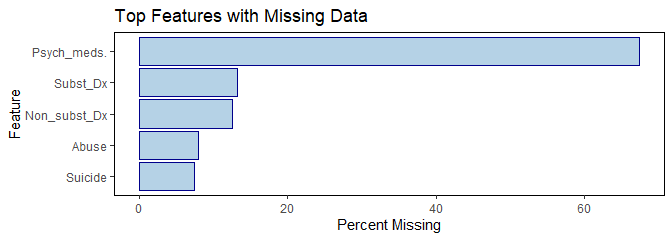
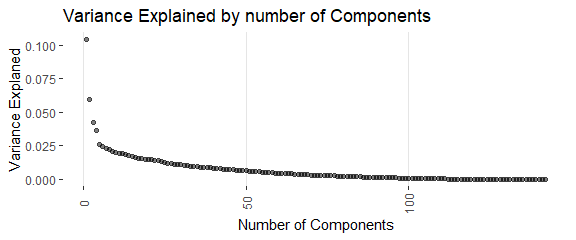
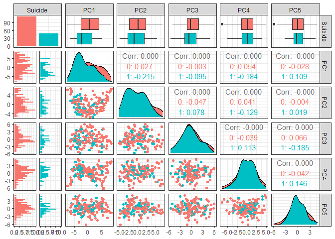
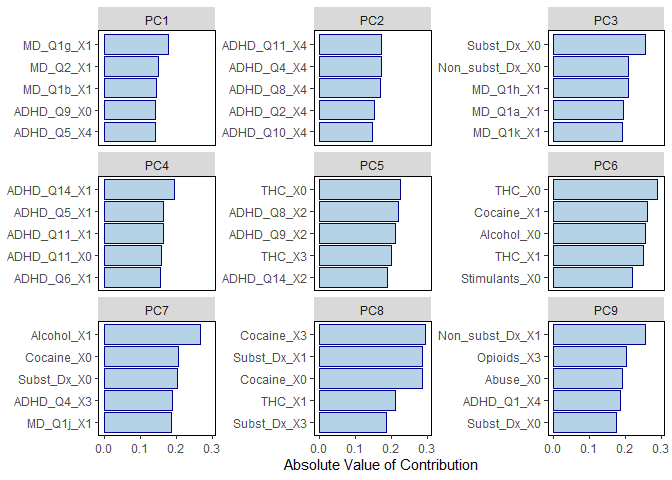
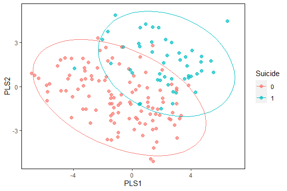
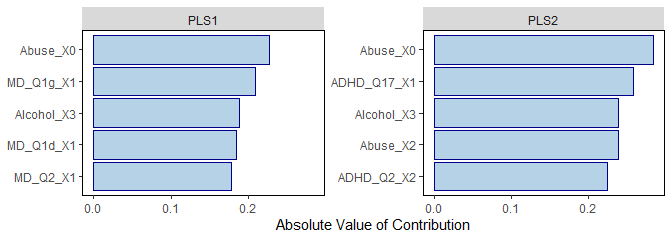
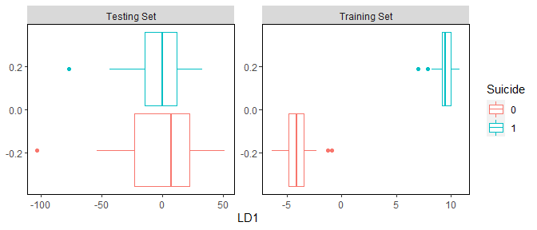
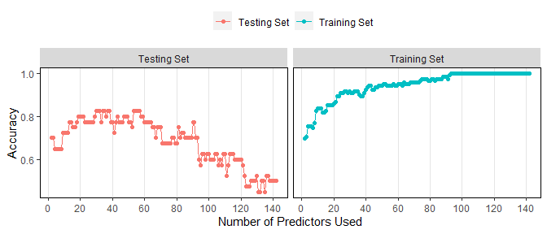
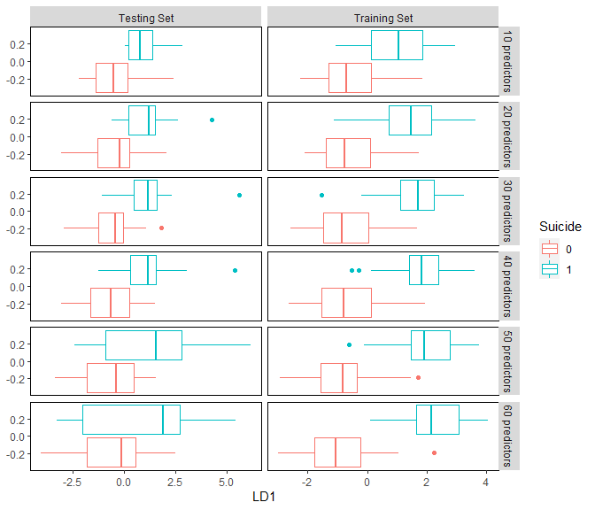

Dimensionality
================
Author - Joshua Registe

## Outline

[RMarkdown Source
Code](https://github.com/joshuargst/Machine-Learning-with-R-and-Python/blob/main/Dimensionality/R/Dimensionality.Rmd)

-   [Dimenstionality Intro](#Dimensionality-Introduction)  
-   [Data Exploration](#Data-Exploration)  
-   [Data Prep](#Data-Preparation)  
-   [Implementing Principal Component
    Analysis](#Principal-Component-Analysis)
-   [Implementing Partial Least Squares](#Partial-Least-Squares)
-   [Implementing Linear Discriminant
    Analysis](#Linear-Discriminant-Analysis)
-   [References](#References)

## Dimensionality Introduction

-   [Return to Outline](#Outline)

The following document will discuss some processes of dimensionality
reduction for datasets. **Why Reduce dimensions?** There are many
benefits to reducing the dimensionality of a dataset including:

-   Discover hidden correlations/topics

-   Information that can be described as a combination rather than
    independently

-   Remove redundant and noisy features. not all words may be relevant
    in a tf-idf, or not all columns may be necessary in a user-item
    matrix

-   Interpretation and Visualization

-   Easier storage and processing of the data along with faster
    processing time

The *curse of dimensionality* occurs when working with highly
dimensional data where issues will begin manifest themselves in several
aspects. Data will become increasingly difficult to visualise and
interpret. Modeling such data will lead to inefficient compute times and
will also lead to overtraining. As more dimensions are introduced, the
data becomes more sparse in terms of rows/column and models will have a
difficult time making generalizations that can be used for accurate
predictions. The figure below shows an example of how dimensions
typically affect model performance.

The dimensionality reduction techniques presented in this document will
showcase the implementation of:

**1. Principal Component Analysis (PCA)**

**2. Partial Least Squares (PLS)**

**3. Linear Discriminant Analysis (LDA)**

## Data Exploration

-   [Return to Outline](#Outline)

The Data set being explored in this document a survey used to assess
Attention deficit hyper activity disorder (ADHD). The dataset consist of
information about patients as well as survey questions that attempt to
segment users into those that are likely or not-likely to have ADHD. The
data dictionary is presented below.

C: Sex: Male-1, Female-2  
D: Race: White-1, African American-2, Hispanic-3, Asian-4, Native
American-5, Other or missing data -6  
E - W ADHD self-report scale: Never-0, rarely-1, sometimes-2, often-3,
very often-4  
X – AM Mood disorder questions: No-0, yes-1; question 3: no problem-0,
minor-1, moderate-2, serious-3  
AN – AS Individual substances misuse: no use-0, use-1, abuse-2,
dependence-3  
AT Court Order: No-0, Yes-1  
AU Education: 1-12 grade, 13+ college  
AV History of Violence: No-0, Yes-1  
AW Disorderly Conduct: No-0, Yes-1  
AX Suicide attempt: No-0, Yes-1  
AY Abuse Hx: No-0, Physical (P)-1, Sexual (S)-2, Emotional (E)-3, P&S-4,
P&E-5, S&E-6, P&S&E-7  
AZ Non-substance-related Dx: 0 – none; 1 – one; 2 – More than one  
BA Substance-related Dx: 0 – none; 1 – one Substance-related; 2 – two; 3
– three or more  
BB Psychiatric Meds: 0 – none; 1 – one psychotropic med; 2 – more than
one psychotropic med

This dataset is a mental health dataset from a real-life research
project. All identifying information of the dataset is removed. The data
contains 54 variables with 175 observations per variable. Every variable
in the dataset is imported in as numeric features with the exception of
`Initial` which will not be used as part of any exploration or analysis.
For brevity, only the non-survey questions are shown in the summary
below, however, all information including survey questions are used in
analysis. View Rmarkdown code to see unhidden descriptive statistics.

|                                                  |            |
|:-------------------------------------------------|:-----------|
| Name                                             | Piped data |
| Number of rows                                   | 175        |
| Number of columns                                | 19         |
| \_\_\_\_\_\_\_\_\_\_\_\_\_\_\_\_\_\_\_\_\_\_\_   |            |
| Column type frequency:                           |            |
| character                                        | 1          |
| numeric                                          | 18         |
| \_\_\_\_\_\_\_\_\_\_\_\_\_\_\_\_\_\_\_\_\_\_\_\_ |            |
| Group variables                                  | None       |

Data summary

**Variable type: character**

| skim\_variable | n\_missing | complete\_rate | min | max | empty | n\_unique | whitespace |
|:---------------|-----------:|---------------:|----:|----:|------:|----------:|-----------:|
| Initial        |          0 |              1 |   2 |   3 |     0 |       108 |          0 |

**Variable type: numeric**

| skim\_variable      | n\_missing | complete\_rate |  mean |    sd |  p0 |  p25 | p50 |  p75 | p100 | hist  |
|:--------------------|-----------:|---------------:|------:|------:|----:|-----:|----:|-----:|-----:|:------|
| Age                 |          0 |           1.00 | 39.47 | 11.17 |  18 | 29.5 |  42 | 48.0 |   69 | ▆▅▇▅▁ |
| Sex                 |          0 |           1.00 |  1.43 |  0.50 |   1 |  1.0 |   1 |  2.0 |    2 | ▇▁▁▁▆ |
| Race                |          0 |           1.00 |  1.64 |  0.69 |   1 |  1.0 |   2 |  2.0 |    6 | ▇▁▁▁▁ |
| Alcohol             |          4 |           0.98 |  1.35 |  1.39 |   0 |  0.0 |   1 |  3.0 |    3 | ▇▂▁▁▆ |
| THC                 |          4 |           0.98 |  0.81 |  1.27 |   0 |  0.0 |   0 |  1.5 |    3 | ▇▁▁▁▃ |
| Cocaine             |          4 |           0.98 |  1.09 |  1.39 |   0 |  0.0 |   0 |  3.0 |    3 | ▇▁▁▁▅ |
| Stimulants          |          4 |           0.98 |  0.12 |  0.53 |   0 |  0.0 |   0 |  0.0 |    3 | ▇▁▁▁▁ |
| Sedative\_hypnotics |          4 |           0.98 |  0.12 |  0.54 |   0 |  0.0 |   0 |  0.0 |    3 | ▇▁▁▁▁ |
| Opioids             |          4 |           0.98 |  0.39 |  0.99 |   0 |  0.0 |   0 |  0.0 |    3 | ▇▁▁▁▁ |
| Court\_order        |          5 |           0.97 |  0.09 |  0.28 |   0 |  0.0 |   0 |  0.0 |    1 | ▇▁▁▁▁ |
| Education           |          9 |           0.95 | 11.90 |  2.17 |   6 | 11.0 |  12 | 13.0 |   19 | ▁▅▇▂▁ |
| Hx\_of\_Violence    |         11 |           0.94 |  0.24 |  0.43 |   0 |  0.0 |   0 |  0.0 |    1 | ▇▁▁▁▂ |
| Disorderly\_Conduct |         11 |           0.94 |  0.73 |  0.45 |   0 |  0.0 |   1 |  1.0 |    1 | ▃▁▁▁▇ |
| Suicide             |         13 |           0.93 |  0.30 |  0.46 |   0 |  0.0 |   0 |  1.0 |    1 | ▇▁▁▁▃ |
| Abuse               |         14 |           0.92 |  1.33 |  2.12 |   0 |  0.0 |   0 |  2.0 |    7 | ▇▂▁▁▁ |
| Non\_subst\_Dx      |         22 |           0.87 |  0.44 |  0.68 |   0 |  0.0 |   0 |  1.0 |    2 | ▇▁▃▁▁ |
| Subst\_Dx           |         23 |           0.87 |  1.14 |  0.93 |   0 |  0.0 |   1 |  2.0 |    3 | ▆▇▁▅▂ |
| Psych\_meds.        |        118 |           0.33 |  0.96 |  0.80 |   0 |  0.0 |   1 |  2.0 |    2 | ▇▁▇▁▆ |

After observing the data’s structure, the next step was to plot the data
to assess how this data is portrayed and what observations we can make
about the distributions involved in the dataset. Based on the
histrograms plotted below, we can note that there are many observations
although numeric, behave as categorical features and this will need to
be assessed when performing the dimensionality reductions because they
typically work on normalized numeric data. There does not seem to be any
clear distinguishable outliers however there does seem to be some
features that experience low variance such `Stimulants` where majority
of the recorded observations are 0.

To reduce noise and complexity of the dataset prior to modeling,
multi-colinearity (if it exists) should be addressed. The dataset was
assessed for pairwise spearman correlations which measures data for it’s
monotonicity providing a regression coefficient that defines both linear
and non-linear trends. Dimensionality reduction techniques are capable
of identify colinearity and aggregating features, however removing
highly relational information can help reduce noise in the dataset and
better focus the dimension reduction processes. The table below shows we
do exhibit correlations particularly amongst features that are directly
related such as the `ADHDQ#` to the `ADHD_Total`. Highest measured
spearman rank was around 0.79.

    ## # A tibble: 6 x 4
    ##   x        y          correlation cor_type
    ##   <chr>    <chr>            <dbl> <chr>   
    ## 1 ADHD_Q9  ADHD_Total       0.794 spearman
    ## 2 ADHD_Q8  ADHD_Total       0.794 spearman
    ## 3 ADHD_Q10 ADHD_Total       0.787 spearman
    ## 4 ADHD_Q13 ADHD_Total       0.767 spearman
    ## 5 ADHD_Q5  ADHD_Total       0.746 spearman
    ## 6 ADHD_Q4  ADHD_Total       0.728 spearman

Next, we want to assess any missing data within the dataset. The models
presented here are also susceptible to missing data and this must be
treated accordingly. The figure below displays a plot of missing data by
percentage of observations in the dataset. It is clear that the feature
`Psych_meds.` has a significant amount of features that are
inappropriate to impute or include and thus this feature will be removed
from the dataset prior to any models.

<!-- -->

## Data Preparation

-   [Return to Outline](#Outline)

For the Data preparation following baseline steps were made and the
reasons are provided below

-   **Remove `Initial`**: Character value that identifies patient with
    which will provide no bearing on the model output

-   **Removal `Psych_meds.`**: Removed due to large amount of missing
    data (&gt;60% observations missing)

-   **Removal `totalized features`**: Remove features that are
    summations of other features

-   **Imputation of missing data with KNN:** the remaining data was
    imputed with K-nearestneighbors (KNN) as a way to fill in missing
    gaps. alternative methods include median, mean, or bag imputations
    but it was determed that KNN provides the best results with minimal
    effect on computational effort.

-   **Numeric to Factor Conversions**: Several variables were with low
    distribution were converted into classes based on their categorical
    nature displayed in the histograms presented in the
    `Data Exploration` section. This conversion was made to all
    variables in the dataset except for `Age`, `ADHD.Total`, and
    `MD.Total`.

-   **Dummifying Variables**: Newly transformed categorical variables
    were binarized into 0/1. This is particularly important for k-means
    because k-means will not be able to distinguish the eucliiand
    distances properly between classes that span more than 2 categories.
    For example a feature with categories 1,2,3 will not properly be
    computed in k-means because 1,3 will measure greater distances than
    1,2, thus binarizing each of these categories such that for example
    3 would be its own column with 0/1 for presence/absence is
    absolutely necessary.

-   **Normalization (model dependent)**: Again, due to the euclidian
    nature of k-means clustering, features need to be normalized such
    that the distances they are centered and scaled the mean is 0 and
    the Stdev is 1, this scales all the data to allow kmeans to
    appropriately place centroids and observations at appropriate
    distances.

-   **Colinearity test**: Colinearity was tested and it was determined
    that there was not sufficient colinearity between any variables such
    that they needed to be removed for this reason alone.

-   **Removed low-variance features**: Removing any extremely
    low-variance data that will not provide useful data to the model and
    will only contribute to noise. At first glance, From
    `Data Exploration` section `Stimulants` seems like a low-variance
    variable with majority of categories recorded at 0. This will be
    confirmed statistically with tidymodels. Based on the model
    adjustment below, there were many features that were too sparse to
    provide valuable information to the model that including but not
    limited to: `Race_X3`, `Race_X6`, `ADHD_Q5_X5`, `Alcohol_X0.6` and
    more. The total amount of features used in model after removing
    sparse parameters went from 238 to 147 The model recipe is shown
    below.

## Principal Component Analysis

-   [Return to Outline](#Outline)

Principal Component Analysis (PCA) will be the first implementation of
dimensionality reduction in this document. This methodology aims to
describe majority of the variance in a dataset through standardizing the
continous values (z-scores), computing the covariance matrix and
computing eigenvectors and eigenvalues to identify the principal
components. The eiven values are ranked by best descriptors and each
successive principal component describes less and less of the data.

    ## Data Recipe
    ## 
    ## Inputs:
    ## 
    ##       role #variables
    ##    outcome          1
    ##  predictor         53
    ## 
    ## Training data contained 175 data points and 120 incomplete rows. 
    ## 
    ## Operations:
    ## 
    ## Variables removed Initial, Psych_meds. [trained]
    ## Variables removed ADHD_Total, MD_TOTAL [trained]
    ## Removing rows with NA values in Suicide
    ## K-nearest neighbor imputation for Sex, Race, ADHD_Q1, ADHD_Q2, ADHD_Q3, ... [trained]
    ## Variable mutation for Sex, Race, ADHD_Q1, ADHD_Q2, ... [trained]
    ## Dummy variables from Sex, Race, ADHD_Q1, ADHD_Q2, ADHD_Q3, ADHD_Q4, ... [trained]
    ## Centering and scaling for Age, Sex_X1, Sex_X2, Race_X1, Race_X2, ... [trained]
    ## Sparse, unbalanced variable filter removed Race_X3, Race_X6, ... [trained]
    ## Correlation filter removed Race_X2, Sex_X1, MD_Q1a_X0, ... [trained]
    ## PCA extraction with Age, Sex_X2, Race_X1, ADHD_Q1_X0, ... [trained]

After running PCA based on the recipe defined above, we can visualize
how much of the dataset is explained by the principal components. the
figure below shows how the curve tapers off. The determination of how
many principal components to use for a model will depend on the end
goal, performance requirements, and computational limitations.

<!-- -->

PCA does not aim to describe a particular prediction, only the overall
variance of a dataset. In later dimensionality reduction methods, this
document will explore if we can predict `Suicide` based on the
information provided in the `ADHD_dataset`. Below shows a scatter matrix
of the first principal components and described by whether or not the
patient was suicidal. Since PCA does not aim to predict this, there are
no clear distinctions, however this dimensionally reduced dataset can be
used in a predictive model that might capture this information.

<!-- -->

One of the downsides of using PCA is losing explainability of a model.
Once you use this technique prior to running an algorithm like random
forest for example, assessing feature importance becomes increasingly
vague as you no longer have the original predictors. important features
will be described as principal components but these components are
simply some mathematical aggregate of the original features. That said,
one of the nice features about PCA computed from `tidymodels` is the
ability to assess the weights of every feature to every principal
component produced. The plot below shows which features are described
most in each principal component.

<!-- -->

## Partial Least Squares

-   [Return to Outline](#Outline)

Partial Least Squares is a popular method that is used especially in
high-dimensions datasets. PLS is more robust than ordinary least squares
(OLS) especially when data are colinear since PLS naturally manages this
while OLS becomes very unstable. Partial least squares are like a
supervised version of principal component analysis, where it aims to
reduce dimensions while considering how this affects a response variable
for prediction. Basically, PLS aims to reduce the dimensionality while
simultaneously maximizing the correlation of the new dimensions to the
response variable(s). In this case, we will continue to observe suicidal
patients.

The pre-processing that was developed prior is used and PLS is applied
while trying to maximize separation of the outcome. The figure below
shows the separation that we obtain with PLS after reducing the dataset
into two dimensions.

<!-- -->

Similar to how we did PCA, is the features that contributed most each of
the components. This provides more valuable information than the
previous PCA model since predictions are being produced. The components
that reduce variance and maintain predictive power include `abuse`, and
`alcohol`, implying that individuals who experience abusive childhoods
or alcoholism may be more susceptible to suicide.

<!-- -->

## Linear Discriminant Analysis

-   [Return to Outline](#Outline)

Finally, linear discriminant analysis will be the last tool used for
both dimensionality reduction and producing classification predictions.
This method aims to minimize the total probability of misclassifications
and is often one of the initial tools used for less complex predictions.
For this evaluation, we will consider both training and testing data to
demonstrate the sensitivity of LDA to dimensionality. The data will be
split 75/25 train/test split stratified by suicide where the original
proportion of the suicidal patients are 30%.

Results of the LDA are shown below where you’ll notice that the model is
overfitting. The training set has perfect separation of the response
variable while the testing dataset separates the classes worse than the
original dataset with no model. This is where we will demonstrate the
effects of dimensionality.

<!-- -->

As stated previously, those using LDA must be aware of the number of
samples that are being used relative to the number of features
(predictors) in the dataset. LDA will have less focused prediction when
combining too many features onto a single plane (one linear discriminant
component). Because of this, we will test predictions on LDA using a
decreased number of planes up to the max. The descriptors added will be
sorted based on the the PLS analysis determination of feature
importance. Highly predictive features from the partial least squares
evaluation is used as a sorting mechanism to sequentially add from most
predictive to least predictive.

The plot below clearly demonstrates the curse of dimensionality where
our model begins to suffer in accuracy after around 40 predictors.

<!-- -->

Looking around the peak of where data dimensionality can be useful to
understaning the separation between the two classes. The figure below
shows this separation by the number of predictors for both the training
the the testing dataset from 10 predictors to 60 predictors. Although 30
and 40 predictors have comparable accuracies, better separation seems to
be present on the testing set with 30 predictors (this is likely due to
the influence of the majority class).

<!-- -->

Further evaluation on these models would need to be considered to assess
the confusion matrices and their true positive and false positive rates.
This would provide further insight into the model’s performance on the
minority class (suicidal, 30% presence in original dataset) vs the
majority (non-suicidal, 70% in original dataset).

## References:

-   [Return to Outline](#Outline)

<https://cmdlinetips.com/2020/06/pca-with-tidymodels-in-r/>

<https://juliasilge.com/blog/cocktail-recipes-umap/>

<https://builtin.com/data-science/step-step-explanation-principal-component-analysis>

<http://appliedpredictivemodeling.com/>

<https://sebastianraschka.com/Articles/2014_python_lda.html#principal-component-analysis-vs-linear-discriminant-analysis>
