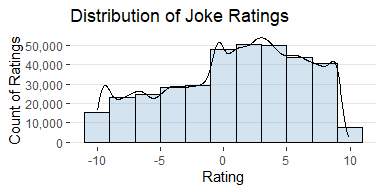
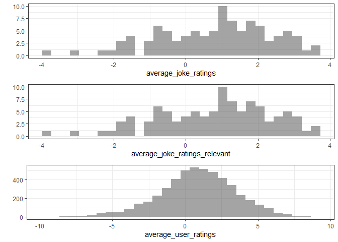
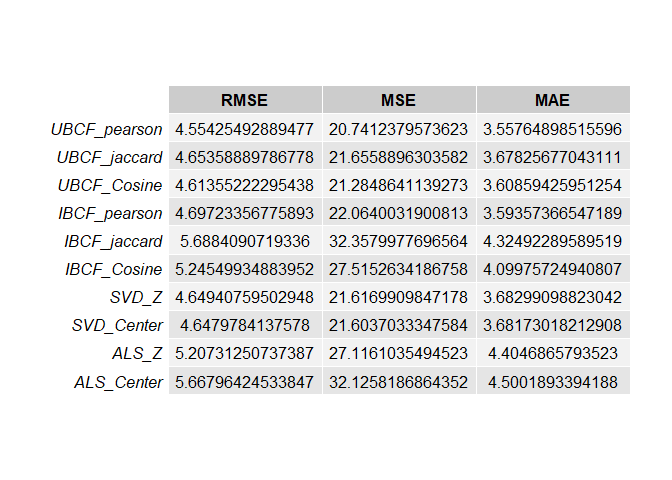
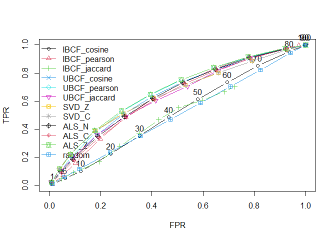
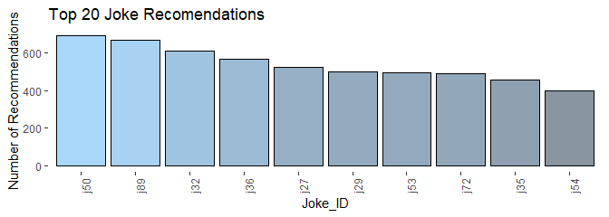
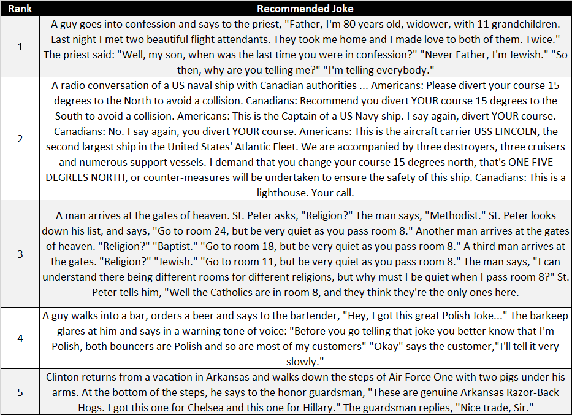

Want to Hear A Joke?
================
**Author: Joshua Registe**

## Outline:

[Recommender System](##Recommender-System)


## Recommender System

Skip to the end for spoiler on most recommended jokes. This document
will present a high-level overview on the implementation of recommender
systems. The raw code for this document can be found here: [RecommenderSystems.Rmd](https://github.com/joshuargst/Machine-Learning-with-R-and-Python/blob/main/Recommender%20Systems/R/RecommenderSystems.Rmd). The recommender systems that will be evaluated in this document are:

1.  **Item-Based Collaborative Filtering (IBCF)** :shopping_cart::shopping_cart:
    -   IBCF is a method that looks at similarities between items
        (movies) and makes recommendations. The algorithm considers
        user’s purchases (items) and recommends similar items and the
        core of this algorithm is based on: how similar 2 items are when
        receiving similar ratings from similar users, identifying the
        k-most similar items and identifying user specific
        recommendations based on user purchase history. The results of
        the top 20 most recommended movies are shown in the following
        figure.
2.  **User-Based Collaborative Filtering (UBCF)** :family_woman_woman_boy_boy:
    -   UBCF is a method that looks at similarities between users and
        makes recommendations to users based on this similarity. The
        algorithm measures how similar each user is to another and a
        similarity matrix can define the top similar users via an
        algorithm like k-nearest neighbors, or similarity can be
        determined by some threshold similarity value. The user ratings
        are used as a weight on the movies and this is multiplied by the
        similarity coefficient in order to prioritize recommendations.
        We can apply the same code and thought process to the
        `recommender` function and use method UBCF and the most
        recommended movies can be found in the following figure.
        (“Collaborative” refers to the notion that users or items
        collaborate with each other via similarities that are defined in
        the models to come up with new recommendations.)
3.  **Singular Vector Decomposition (SVD)** :heavy_multiplication_x::heavy_division_sign:
    -   Singular value decomposition (SVD) is a common dimensionality
        reduction technique that identifies latent semantic factors for
        retrieving information. Some of the difficulties associated with
        this technique can be contributed to sparse data (missing
        values) often present in user-item matrices. Unfortunately
        filling huge matrices with missing values can often be expensive
        or even misleading. Regularization models (penalty-based error
        minimizing) can assist with this.
4.  **Alternative Least Squares (ALS)** :black_large_square::black_medium_square::black_medium_small_square:
    -   Alternative Least Squares algorith factorizes a matrix into two
        factors such that the original matrix is approximately equal to
        the transpose of the first factor matrix multiplied by the
        second factor matrix.

## Dataset and Setup

The following assignment dives into the use of recommender systems via
the r package `recommenderlab`. the vignette for this library can be
<a href="https://cran.r-project.org/web/packages/recommenderlab/vignettes/recommenderlab.pdf">
found here</a>. The dataset that will be used will be pulled directly
from the recommender systems package and this document will expand upon
examples produced in Chapter 3 and Chapter 4 of ***Building A
Recommendation System With R (Suresh K. Gorakala, Michaele Usuelli,
2015)***. The seed is set as 1 for repeatability and the list of
recommender models from the `recommenderlab` package are shown below.


The Jester5k dataset from `recommenderlab` provides a dataset with 100
jokes and 5000 people who have rated some of these jokes from -10
(worst) to 10 (best). The data can be extracted from the Jester5k as a
matrix and can be used in our recommendation system with a few
modifications that will be outlined herein. For jokes where users did
not provide a ranking, Many ratings within the dataset contain NA’s (0’s
when converted to a matrix). It is important that these observations are
omitted from our evaluation. The distribution of average movie ratings
can be seen in the following figure. This plot is skewed left and
indicates that most jokes are rated between 1 and 8 with 2-4 being the
most frequent ratings. It is relatively rare for jokes to obtain a score
of 10. A sample of 3 jokes from the Jester5k dataset is shown below.



Looking deeper into the Jester5k dataset, we can look at which jokes are
the most viewed and popular within the dataset. The following table
shows all jokes within the dataset ordered by popularity. The 3 figures
below highlight: <br> -Average of joke ratings with all movies
considered. <br> -Average of joke ratings with adjusted distribution.
<br> -Average of user ratings. <br> <br> Based on the first two plots we
can assume that the dataset for Jester5k is quite robust in terms of
missing values. Thus the second plot provides this same distribution
except with jokes that have at least 100 ratings and it is identical to
the first. The Third figure provides a plot of average user ratings on
the jokes which follows a normal distribution with a mode between 1 and
2.



### Process and Goal

<br> The dataset will use cross validations and will be split into
train/test datasets at a 80/20 ratio. The number of recommendations made
to each user will be specified as 10. This parameter will be tweaked
during an accuracy check to assess model performance.

The goal of our model is on the basis of serendipity and will recommend
jokes to users based on an above average/median rating of 3. This
slightly decreases recommendation accuracy than when using 0, however it
makes for better quality recommendations.

#### Setting Model Parameters and Cross-Validation Data

The following presents the constants used in across all recommender
systems. For simplicity, these parameters will not be tuned in this
discussion. Three datasets are used, `rec_train` to train our model from
each fold, `recc_known` to make our predictions, and `recc_test` to test
our model on unknown data.

``` r
#filtering for users who have watched at least 50 movies, and movies with at least 100 views
ratings_jokes <- Jester5k[rowCounts(Jester5k) > 50,  
                             colCounts(Jester5k) > 100] 

train_percent<-0.8
kept_items<-15
rating_threshold<-3
n_eval<-3
no_recommendations<-10
set.seed(1)
eval_sets <- evaluationScheme(data = ratings_jokes, method = "cross-validation", 
                              train = train_percent, given = kept_items, goodRating = rating_threshold, k = n_eval)

#used to train
recc_train<- getData(eval_sets,'train')
#used to predict
recc_known<-getData(eval_sets,'known')
#used to test
recc_unknown<-getData(eval_sets,'unknown')
```

#### Evaluating Recommenders

Evaluating the recommenders, we will calculate our root mean square
error (RMSE) for each model. For the collaborative models (UBCF and
IBCF), we are using 3 different methods: `pearson`, `jaccard`, and
`cosine.` for the factorization models (SVD and ALS), we will also test
z-score and center normalization. Below provides a summary of each model
and their RMSE where the best performing models was UBCF Pearson, UBCF
Cosine and singular value decomposition. While the models that did not
perform as well include ALS with centered normalization and IBCF
Jaccard.

``` r
##Warning, training these models takes quite a bit of processing time
{
  UBCF_pearson_eval<-Recommender(recc_train,method = "UBCF", parameter = list(method = "pearson"))
  UBCF_jaccard_eval<-Recommender(recc_train,method = "UBCF", parameter = list(method = "jaccard"))
  UBCF_cosine_eval<- Recommender(recc_train,method = "UBCF", parameter = list(method = "cosine"))
  IBCF_pearson_eval<-Recommender(recc_train,method = "IBCF", parameter = list(method = "pearson"))
  IBCF_jaccard_eval<-Recommender(recc_train,method = "IBCF", parameter = list(method = "jaccard"))
  IBCF_cosine_eval<- Recommender(recc_train,method = "IBCF", parameter = list(method = "cosine"))
  SVD_Z_eval<-       Recommender(recc_train,method = "SVD", parameter = list(normalize = "Z-score"))
  SVD_center_eval<-  Recommender(recc_train,method = "SVD", parameter = list(normalize = "center"))
  ALS_Z_eval<-       Recommender(recc_train,method = "ALS", parameter = list(normalize = "Z-score"))
  ALS_center_eval<- Recommender(recc_train,method = "ALS", parameter = list(normalize = "center"))
}
recommendations<-function(eval){
  recc_predicted<-predict(object = eval,newdata=recc_known,n=no_recommendations)
}

ModelErrors<-function(eval){
  
    recc_predicted<-predict(object = eval,newdata=recc_known,n=no_recommendations, type= "ratings")
    calcPredictionAccuracy(recc_predicted,recc_unknown, byUser = F)

}

rbind(
  UBCF_pearson= ModelErrors(UBCF_pearson_eval),
  UBCF_jaccard = ModelErrors(UBCF_jaccard_eval),
  UBCF_Cosine = ModelErrors(UBCF_cosine_eval),
  IBCF_pearson= ModelErrors(IBCF_pearson_eval),
  IBCF_jaccard = ModelErrors(IBCF_jaccard_eval),
  IBCF_Cosine = ModelErrors(IBCF_cosine_eval),
  SVD_Z= ModelErrors(SVD_Z_eval),
  SVD_Center= ModelErrors(SVD_center_eval),
  ALS_Z= ModelErrors(ALS_Z_eval),
  ALS_Center= ModelErrors(ALS_center_eval)
) %>% 
  grid.table()
```



Additionally, Time to train and test for recommender systems is an
important consideration and these models can have vastly different
computational speeds. Although UBCF performs well, if prediction speed
is a priority, SVD models would be the better choice as it provides
comparable accuracies at a fraction of the speed.

``` r
  models_to_evaluate <- list(
    IBCF_cosine = list(name = "IBCF", param = list(method = "cosine")), 
    IBCF_pearson = list(name = "IBCF", param = list(method ="pearson")), 
    IBCF_jaccard = list(name = "IBCF", param = list(method ="jaccard")), 
    UBCF_cosine = list(name = "UBCF", param = list(method ="cosine")), 
    UBCF_pearson = list(name = "UBCF", param = list(method ="pearson")), 
    UBCF_jaccard = list(name = "UBCF", param = list(method ="jaccard")), 
    SVD_Z = list(name = "SVD", param = list(normalize = "Z-score")),
    SVD_C = list(name = "SVD", param = list(normalize = "center")),
    ALS_N = list(name = "ALS", param = list(normalize = NULL)),
    ALS_C = list(name = "ALS", param = list(normalize = "center")),
    ALS_Z = list(name = "ALS", param = list(normalize = "Z-score")),
    random = list(name = "RANDOM", param=NULL)
  )
  
  n_recommendations <- c(1, 5, seq(10, 100, 10))

  list_results <- evaluate(x = eval_sets, method = models_to_evaluate, n= n_recommendations)
```

    ## IBCF run fold/sample [model time/prediction time]
    ##   1  [0.13sec/0.19sec] 
    ##   2  [0.13sec/0.23sec] 
    ##   3  [0.14sec/0.18sec] 
    ## IBCF run fold/sample [model time/prediction time]
    ##   1  [0.14sec/0.25sec] 
    ##   2  [0.13sec/0.19sec] 
    ##   3  [0.12sec/0.19sec] 
    ## IBCF run fold/sample [model time/prediction time]
    ##   1  [0.12sec/0.18sec] 
    ##   2  [0.11sec/0.13sec] 
    ##   3  [0.12sec/0.16sec] 
    ## UBCF run fold/sample [model time/prediction time]
    ##   1  [0.01sec/3.09sec] 
    ##   2  [0.01sec/2.93sec] 
    ##   3  [0.03sec/3.08sec] 
    ## UBCF run fold/sample [model time/prediction time]
    ##   1  [0.01sec/2.85sec] 
    ##   2  [0.01sec/2.86sec] 
    ##   3  [0.01sec/2.75sec] 
    ## UBCF run fold/sample [model time/prediction time]
    ##   1  [0.01sec/2.94sec] 
    ##   2  [0.01sec/3.15sec] 
    ##   3  [0.02sec/2.8sec] 
    ## SVD run fold/sample [model time/prediction time]
    ##   1  [0.11sec/0.17sec] 
    ##   2  [0.1sec/0.16sec] 
    ##   3  [0.09sec/0.18sec] 
    ## SVD run fold/sample [model time/prediction time]
    ##   1  [0.04sec/0.33sec] 
    ##   2  [0.05sec/0.14sec] 
    ##   3  [0.03sec/0.14sec] 
    ## ALS run fold/sample [model time/prediction time]
    ##   1  [0sec/86sec] 
    ##   2  [0sec/87.3sec] 
    ##   3  [0sec/85.94sec] 
    ## ALS run fold/sample [model time/prediction time]
    ##   1  [0sec/86.36sec] 
    ##   2  [0sec/86.25sec] 
    ##   3  [0sec/87.55sec] 
    ## ALS run fold/sample [model time/prediction time]
    ##   1  [0sec/87.16sec] 
    ##   2  [0sec/86.95sec] 
    ##   3  [0sec/87.51sec] 
    ## RANDOM run fold/sample [model time/prediction time]
    ##   1  [0sec/0.16sec] 
    ##   2  [0sec/0.17sec] 
    ##   3  [0sec/0.16sec]

There are several methods to define which models produce greater
results. Some common metrics for model evaluations are: root mean square
error (RMSE) as shown above, mean square error (MSE), mean absolute
error (MAE), receiver operating characteristic (ROC), area under the ROC
curve (AUC). The metric presented below is the ROC curve for all models
In addition to the models, a random or “guessing” recommendation will be
produced in order to have a baseline to compare model performance to.
The plot below support the RMSE test above with the UBCF pearson model
performing the best amongst all of the different methods.

``` r
  IBCF_Models<-models_to_evaluate[c(1,2,3,12)]
  UBCF_Models<-models_to_evaluate[c(4,5,6,12)]
  SVD_Models<-models_to_evaluate[c(7,8,12)]
  ALS_Models<-models_to_evaluate[c(9,10,11,12)]
  avg_matrices <- lapply(list_results, avg)
  plot(list_results, annotate = 1, legend = "topleft", main = "ROC curve") 
```



### Most Recommended Jokes?

And finally, to see the top jokes from some of our recommender models we
can match the jokeID to the Jester5k dataset and extract the jokes. The
following provides a table of 5 jokes from a few models. Based one of
the better recommender systems, the following jokes are highly
suggested.

``` r
UBCF_pearson_eval<-Recommender(recc_train,method = "UBCF", parameter = list(method = "pearson"))
recc_eval<-UBCF_pearson_eval

recc_predict<-predict(object = recc_eval,newdata = recc_known, n = no_recommendations, type = "ratings")

#this method will use the user rating as a weight, the similarity of the joke to other jokes, and multiply the weight by the similarities to come up with recommendations

recc_predicted<-predict(object = recc_eval,newdata=recc_known,n=no_recommendations)

recc_matrix <- sapply(recc_predicted@items, function(x){
  colnames(ratings_jokes)[x]
})


number_of_items<-recc_matrix %>% unlist() %>% table() %>% as.data.frame()

table_top <- data.frame("Joke_ID" = number_of_items$.,  
                        "Recommendation_Count"= number_of_items$Freq)


topjokes<-rbind(table_top %>%
  top_n(5) %>% arrange(desc(Recommendation_Count)))

JesterJokesDF<-data.frame(JesterJokes)
JesterJokesDF$Joke_ID<-row.names(JesterJokesDF)
jokes<-JesterJokesDF[match(unique(topjokes$Joke_ID),JesterJokesDF$Joke_ID),]
#jokes$JesterJokes %>% write.csv("recommended_jokes.csv") Writes jokes to CSV

table_top %>%
  top_n(10) %>% 
  ggplot(mapping = aes(x=fct_reorder(Joke_ID,-as.numeric(Recommendation_Count)), y = as.numeric(Recommendation_Count)))+
  geom_col(aes(fill = as.numeric(Recommendation_Count)),color = 'black', alpha = 0.5)+
  theme(axis.text.x = element_text(angle = 90),
        legend.position = 'none',
        panel.grid = element_blank(),
        panel.background = element_blank())+
  labs(x = "Joke_ID",
       y = "Number of Recommendations",
       title = "Top 20 Joke Recomendations")
```




